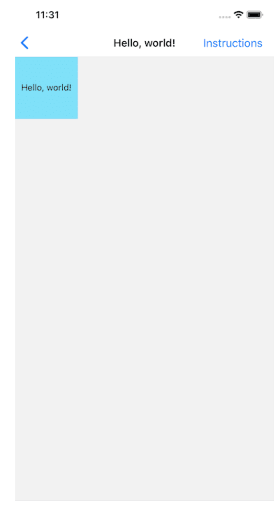
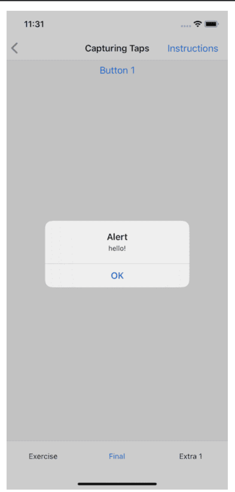
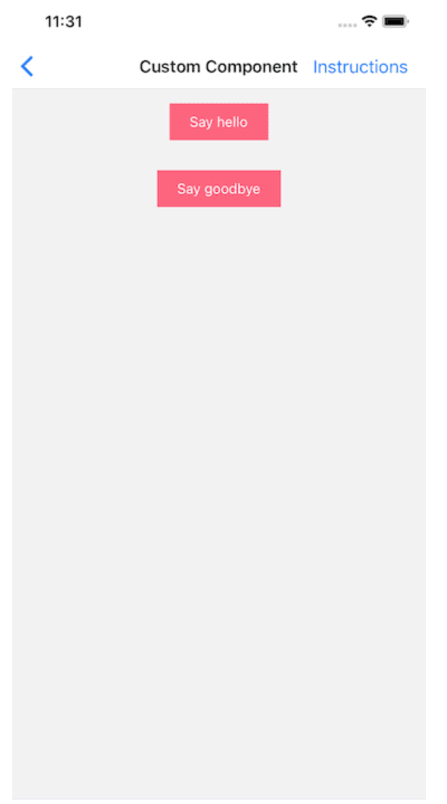
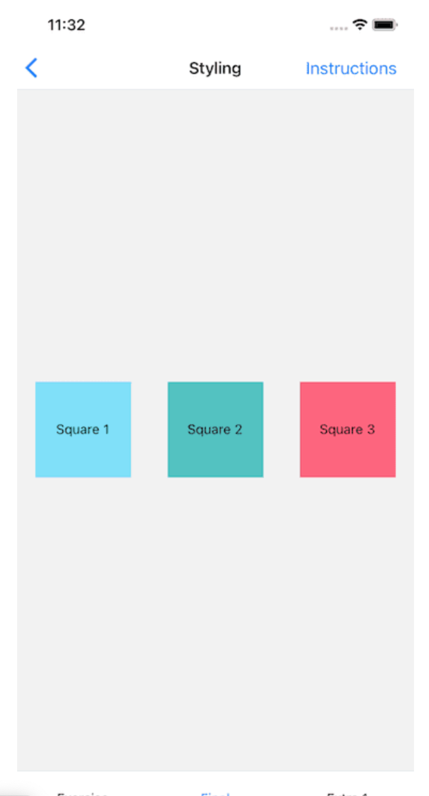
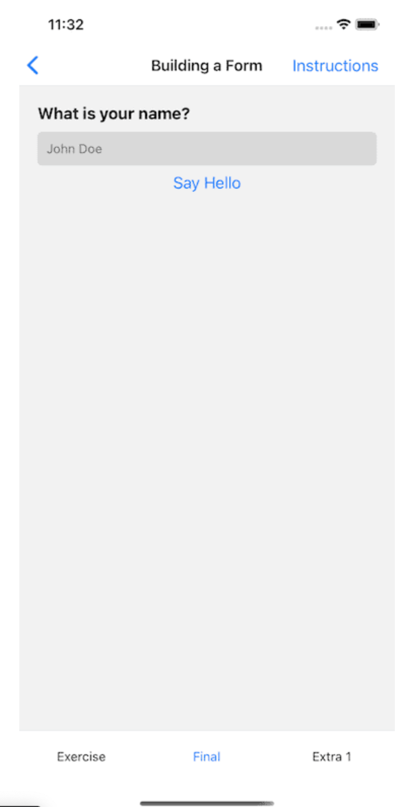

# Lesson Plan

This lesson will about practicing

## Exercises

- #### Exercise 1

The classic starter project. Render a square with a background color. Inside of the square render the text "Hello, world".

- #### Exercise 2

An application doesn't bring a lot of value if a user can't interact with it. The most basic form of interaction is capturing a user's tap (or press) on a screen. Using the Button component, capture a tap event and alert "hello".

- #### Exercise 3

Previously we've been exclusively using component from React Native. But what about our creating our own? Build your own `button component` that accepts an `onPress` and `text prop`. Use the `TouchableOpacity` and Text components to accomplish this.

- #### Exercise 4

 If you're familiar with CSS-in-JS you should be able to fall right into styling in React Native as it follows the same principles. Create `3 squares` that are `vertically` and `horizontally centered`. Each square should have a `unique background color` but all shared styles should only be defined once.

 

 - #### Exercise 5

Much like you would have an input in HTML, React Native has the `TextInput component`. The big difference between the two is that, with a TextInput, you get no styling with it - you're responsible for it all. Using the `TextInput component` capture a `user's name` and, upon a `button press`, `alert` their `name `back to them. Add some style to the TextInput while you're there.

  

  - #### Exercise 6

   Using previous knowledge of building form, create `login` form.

  
